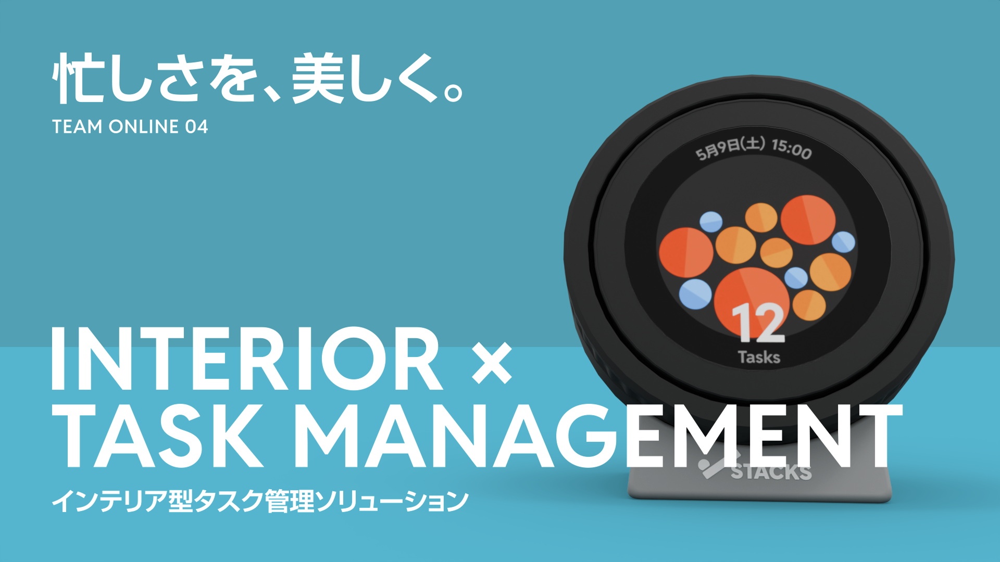

# Stacks

## 忙しさを、美しく。インテリア型タスク管理ソリューション

## Introduction

スマートフォンや PC でのタスク管理が当たり前になった今、「やることリスト」はますます増える一方です。ただ、画面の中にあるだけのタスクはどこか実感が薄く、自分がどれだけ抱えているかを把握しにくい側面があります。Stacks は、タスクの量を**可視化・物理化**することで、その課題にアプローチするデバイスです。

> [!TIP]
> Youtube: https://www.youtube.com/watch?v=emxMcyfFROg

---

## What's Stacks?

### コンセプト：小さくなる日本に必要なもの

Stacks の開発背景には、日本の単身世帯の増加があります。厚生労働省「国民生活基礎調査」によると、**日本全体の34%は単身世帯**（約1,849.5万世帯）です。自分のことを自分で管理する場面が増えている中で、タスク管理をもう少し楽にしたい、というのが出発点です。

### 3つの中核機能

#### 1. Google Todo リストとの連携
既存の Google Todo リストと同期します。新しいツールに移行するコストなく使い始められます。

#### 2. 残りタスク量の可視化
同期されたタスクを、色とサイズが異なるボールとして円形ディスプレイ内に表示します。タスクが「積まれていく」様子をひと目で把握できます。

#### 3. 直感的なタスク操作
回転する外枠を操作することでページ移動やタスクの選択・完了が可能です。キー入力なしで完結します。

### デザイン哲学：インテリア × タスク管理

Stacks の特徴は、**デバイスであることを主張しすぎないデザイン**です。

- **外観**：部屋に置いても違和感のないインテリアとしての質感
- **UI/UX**：シンプルで、外観と統一感のある見た目
- **ネーミング**：タスクが積まれる様子をそのまま「 Stacks 」と表現
